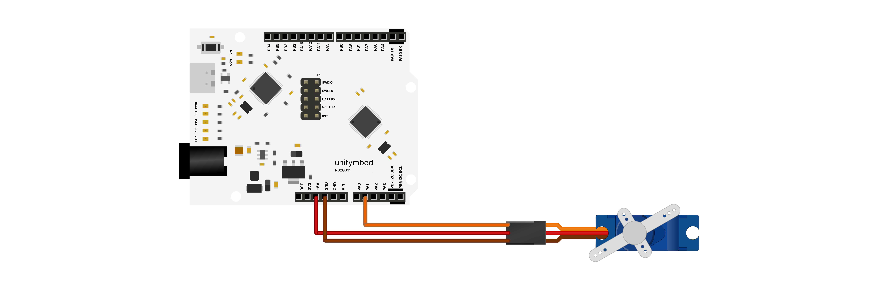

# N32G031_SERVO_SMOOTH — Smooth Servo Sweep

An introductory project designed to teach servo motor control using the **N32G031** microcontroller, with a specific focus on achieving seamless, jerk-free movement (Smooth Sweep). This project serves as an excellent foundational learning tool for robotics and `for` loop applications tailored for kids and beginners. This project is fully optimized for cross-platform workflows using UnityMbed.

---

## Wiring

| Device | Pin | N32G031 | Notes |
| :--- | :--- | :---: | :--- |
| **Servo Motor** | 🤎 Brown / Black | **GND** | Common System Ground |
| (e.g., SG90) | ❤️ Red (VCC) | **5V** | Motor Power Supply |
| | 🧡 Orange / Yellow | **PA1** | Control Signal Pin (PWM Bit-Banging) |

---

## Behaviour & Execution

Once powered on, the robotic arm will smoothly sweep through the following loop continuously:
1. Smoothly sweep from **0 ➡️ 90 Degrees** 🌟 Hold position for 2 seconds.
2. Smoothly sweep from **90 ➡️ 180 Degrees** 🌟 Hold position for 2 seconds.
3. Smoothly sweep back from **180 ➡️ 90 Degrees** 🌟 Hold position for 2 seconds.
4. Smoothly sweep back from **90 ➡️ 0 Degrees** 🌟 Hold position for 2 seconds, then restart the cycle.

---

## Hardware Setup & Troubleshooting

**Hardware Constants & Calibration**
Since every servo motor has minor manufacturing variances, the pulse width constants for this specific setup have been calibrated as follows:
* **0 Degrees (Far Left):** `2250`
* **90 Degrees (Center / Straight Up):** `4400`
* **180 Degrees (Far Right):** `5500`

> **Important Note for Learners:** Avoid pushing these numbers past the motor's physical constraints (Mechanical Limit). Doing so can cause the motor to stall, draw excessive current, and lead to microcontroller freezes or crashes.

---

## Learning & AI Extension Ideas

* **Smooth Movement:** Understand the difference between making a robot "teleport" instantly versus "taking incremental steps" using the `Smooth_Move` function to create life-like, fluid animations.
* **Hardware Calibration:** Gain hands-on experience tuning real hardware parameters (Pulse Width) to accurately calibrate 0, 90, and 180-degree angles.
* **For Loop Application:** Visualize how a `for` loop works by watching the robot's arm move sequentially as numerical values increment or decrement.
* **The Speed Challenge:** Encourage students to modify the step increments inside the `Smooth_Move` function (specifically the `p += 20` and `p -= 20` lines).
  * What happens if they change it to `+= 50`? Does the robot turn faster?
  * What happens if they change it to `+= 5`? Does it create a dramatic slow-motion effect?

---

## Build and Flash (Universal Cross-Platform)
1. **Open Project:** Open this project folder directly in the IDE.
2. **Build & Flash:** Simply click the **Build** and **Flash** buttons on the interface.

---
Part of the [UnityMbed](https://github.com/GRB-UNITYMBED) N32G031 example set.
